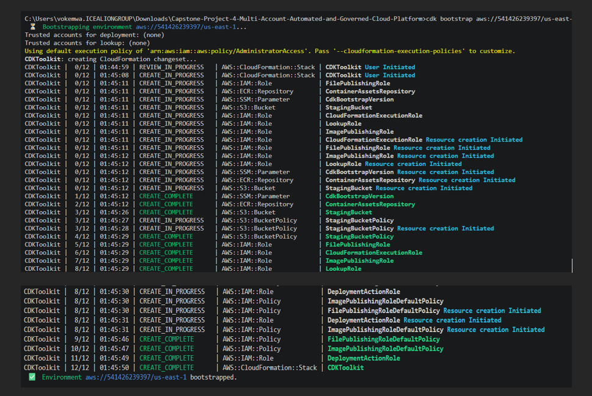
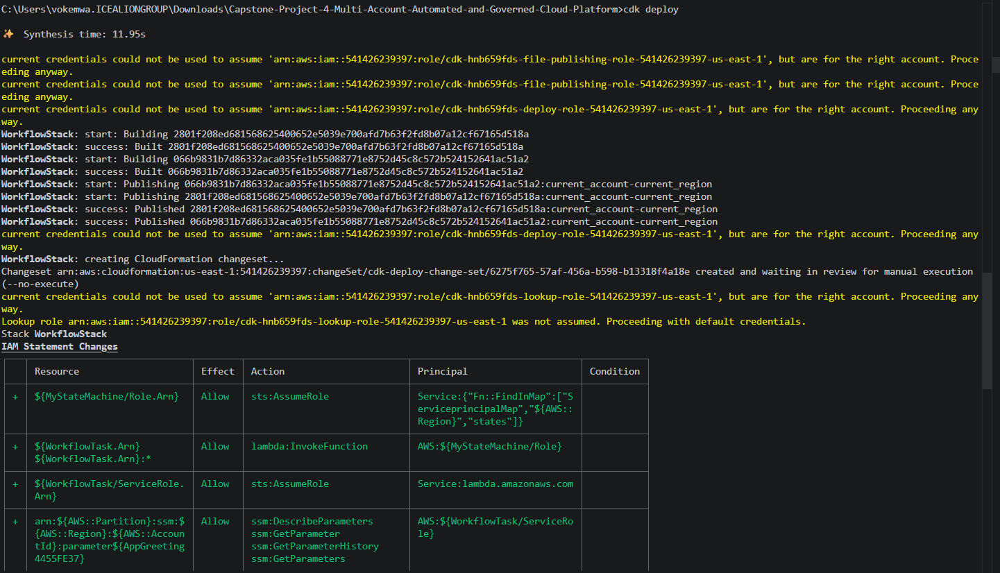
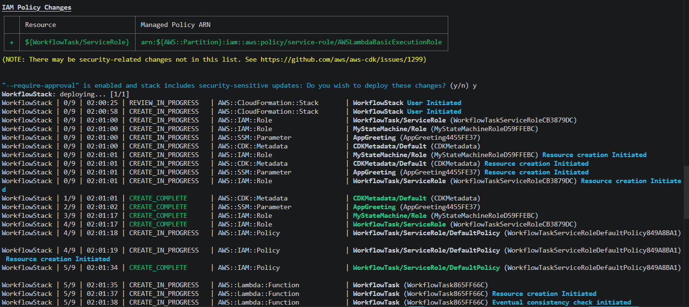
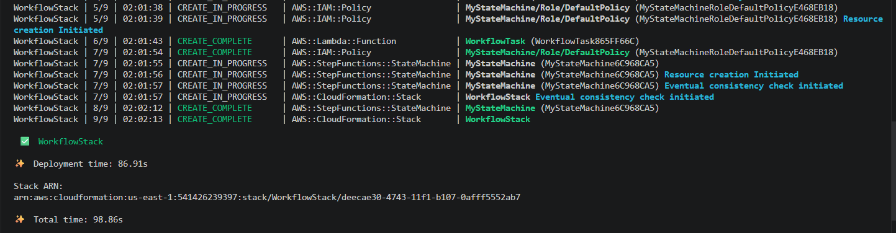
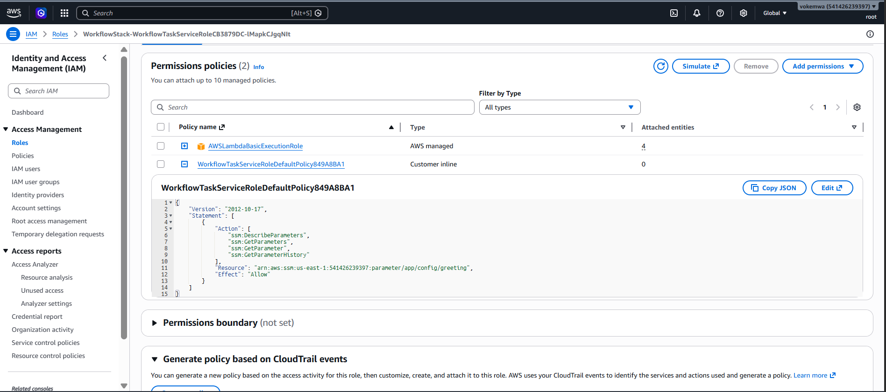
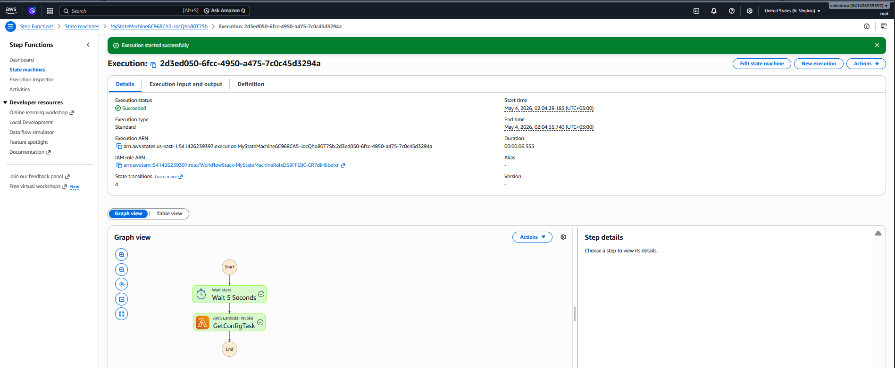
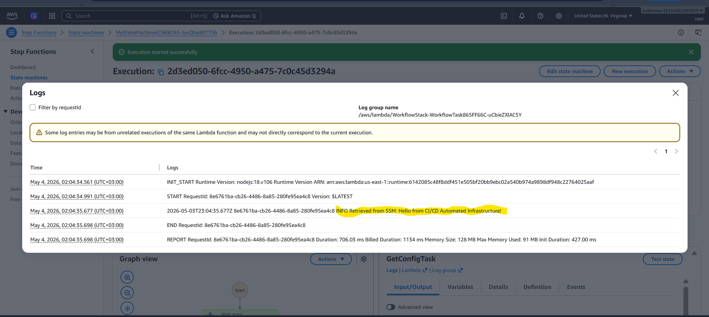
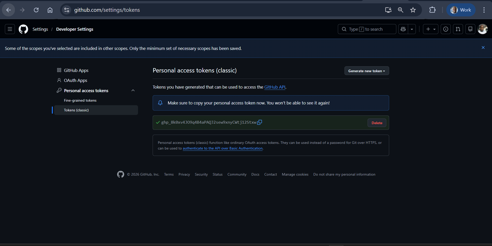
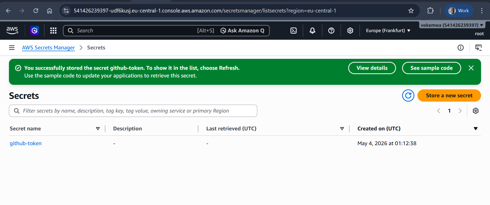
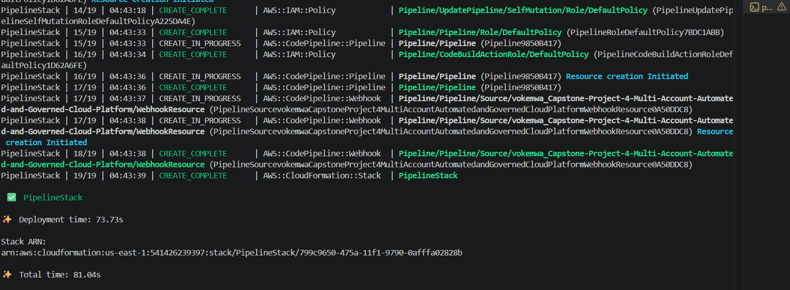

## Created the required files and pushed to the git repository

## Testing Lambda and SSM logic in CLI
* Before the CI/CD pipelines, we need to test and verify whether lambda and SSM actually work in CLI terminal

* We need to bootstrap the aws environment by running this code in the terminal 
`cdk bootstrap aws://541426239397/us-east-1`. This command creates the s3 bucket to hold the assets and Creates the IAM roles that CDK needs to perform the deployment.

## Deploy

Use `cdk deploy` to run the files

## The principle of least priviledge

* go to IAM console and Find the execution role created for the Lambda function

## Verify the workflow

Go to the AWS Step Functions Console. Click on MyStateMachine -> Start Execution. Wait for it to turn green.

## Check the logs
Click the log link to cloudwatch

## CI/CD Automation

We need a Pipeline Stack. This stack will monitor the GitHub repository and automatically run `cdk deploy` whenever you push code.

Before setting up the pipeline, we need to access github from AWS

Go to GitHub -> Settings -> Developer Settings -> Personal access tokens

Generate a token with repo and `admin:repo_hook` permissions.

Store it in `AWS Secrets Manager` as a plaintext secret named `github-token`.

Below is my token generation screen

Save the token key in AWS secret manager

## add pipeline-stack.ts file
under lib, add pipeline-stack.ts to run the pipeline

run this command `cdk deploy PipelineStack`. Now you don't need to run `code deploy` command.

